# Cornell Notes

## Topic: [Driver] I2C (Inter-Integrated Circuit)

## Date: 

---

### Cue Column (Questions, Keywords, or Prompts)

- [Insert question or keyword]
- [Insert question or keyword]
- [Insert question or keyword]

---

### Notes Section (Main Notes)

#### Introduction

I2C is a serial, synchronous, multi-device, half-duplex communication protocol that allows co-existence of multiple masters and slaves on the same bus. I2C uses two bidirectional open-drain lines: serial data line (SDA) and serial clock line (SCL), pulled up by resistors.

For more information about I2C with full details, please refer to:
- [I2C UXP specification](https://www.nxp.com/docs/en/user-guide/UM10204.pdf)

#### ESP32-S3 I2C Overview

ESP32-S3 has 2 I2C controller(s) (also called port), responsible for handling communication on the I2C bus.

A single I2C controller can be a master or a slave.

Typically, an I2C slave device has a 7-bit address or 10-bit address. ESP32-S3 supports both I2C Standard-mode (Sm) and Fast-mode (Fm) which can go up to 100 kHz and 400 kHz respectively.

For more information about I2C provided by Espressif, please refer to:
- [Inter-Integrated Circuit (I2C)](https://docs.espressif.com/projects/esp-idf/en/v6.0/esp32s3/api-reference/peripherals/i2c.html).
- [ESP32S3 Technical Reference Manual](https://www.espressif.com/sites/default/files/documentation/esp32-s3_technical_reference_manual_en.pdf) (Chapter 27 I2C)

##### Warning
The clock frequency of SCL in master mode should not be larger than 400 kHz.

##### Note
The frequency of SCL is influenced by both the pull-up resistor and the wire capacitance. Therefore, it is strongly recommended to choose appropriate pull-up resistors to make the frequency accurate. The recommended value for pull-up resistors usually ranges from `1 kΩ` to `10 kΩ`.

Keep in mind that the higher the frequency, the smaller the pull-up resistor should be (but not less than `1 kΩ`). Indeed, large resistors will decline the current, which will increase the clock switching time and reduce the frequency. A range of `2 kΩ` to `5 kΩ` is recommended, but adjustments may also be necessary depending on their current draw requirements.

##### File Structure
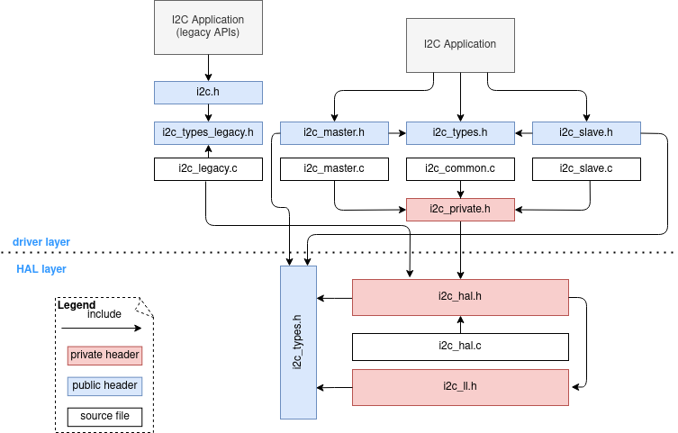
##### Functional Overview
The I2C driver offers following services:
- **Resource Allocation** - covers how to allocate I2C bus with properly set of configurations. It also covers how to recycle the resources when they finished working.
- **I2C Master Controller** - covers behavior of I2C master controller. Introduce data transmit, data receive, and data transmit and receive.
- **I2C Slave Controller** - covers behavior of I2C slave controller. Involve data transmit and data receive.
- **Power Management** - describes how different source clock will affect power consumption.
- **IRAM Safe** - describes tips on how to make the I2C interrupt work better along with a disabled cache.
- **Thread Safety**- lists which APIs are guaranteed to be thread safe by the driver.
- **Kconfig Options** - lists the supported Kconfig options that can bring different effects to the driver.

###### Note
Above information can be found more detail in [Inter-Integrated Circuit (I2C)](https://docs.espressif.com/projects/esp-idf/en/v6.0/esp32s3/api-reference/peripherals/i2c.html). 

It is not necessary to read all the details in the document, but it is recommended to have a quick look at the document to get familiar with the I2C driver.

#### STM32F411CEU6 I2C Overview
TBD
##### File Structure
TBD
##### Functional Overview
TBD


#### AUTOSAR-based I2C API Overview
The AUTOSAR-based I2C API is a set of APIs that provide a high-level interface for I2C communication. It is designed to be easy to use and to provide a consistent interface across different platforms.

The AUTOSAR-based I2C API is built on top of the Espressif I2C driver and provides additional features such as error handling and support for multiple I2C devices.

##### File Structure
The main source and configuration files for the AUTOSAR-based I2C API are:

- `software-architecture/inc/Mcal/I2C/I2c.h`: Public API, types, enums, and callback declaration.
- `software-architecture/src/Mcal/I2C/I2c.c`: Driver implementation (controller/target modes, sync/async paths).
- `software-architecture/src/Mcal/I2C/CMakeLists.txt` (if present): Build integration for the module.
- `GConf/gconf_sy_dat.h`: Platform selection macro (`CPUVENDOR_SC`) used for ESP32/STM32 branches.

##### Functional Overview
The AUTOSAR-based I2C API could be found full detail in [Specification of I2C Driver](../01_Specification/AUTOSAR_CP_SWS_I2CDriver.pdf)

This implementation provides:
- Driver lifecycle management (`I2C_Init`, `I2C_DeInit`).
- External buffer job setup (`I2C_SetupEB`) with per-job validity check.
- Controller mode transfer services:
  - Asynchronous queued transfer (`I2C_AsyncTransmit`).
  - Synchronous blocking transfer (`I2C_SyncTransmit`).
- Target mode listening service (`I2C_StartListening`) for on-demand receive/respond.
- Periodic task-level processing (`I2C_MainFunction`) for polling-mode completion and queue draining.

Execution model:
- `I2C_SetupEB` configures per-job transfer buffers and address.
- Sequence ID is mapped to Job ID in this implementation (`jobId = (I2C_JobType)SequenceId`).
- In async controller mode, requests are either started immediately or queued (FIFO).
- Completion notification is reported through `I2C_SeqEndNotification`.

##### API Reference
```c
void I2C_Init(const I2C_ConfigType *ConfigPtr);
```
Initializes the I2C Driver.
- **Parameters:** `ConfigPtr` - Pointer to a structure containing the configuration information for the I2C Driver.
- **Returns:** None

Behavior summary:
- Validates `ConfigPtr` is not `NULL_PTR`.
- Resets internal sequence/job state and queue state.
- ESP32 branch:
  - Controller mode: creates I2C master bus.
  - Target mode: creates I2C slave device.
  - If `targetListening == TRUE`, registers permanent slave callbacks.
- Sets status to `I2C_IDLE`.

```c
void I2C_DeInit(void);
```
De-initializes the I2C Driver and releases runtime resources.
- **Parameters:** None
- **Returns:** None

Behavior summary:
- Removes master device handles for all jobs.
- Deletes master bus/slave device handles (ESP32 branch).
- Clears setup-valid flags for all jobs.
- Resets status to `I2C_UNINIT` and clears queue/listening runtime state.

```c
Std_ReturnType I2C_SetupEB(I2C_JobType           JobId,
                           I2C_AddressType       NodeAddress,
                           I2C_DataConstPtrType *TxDataBufferPtr,
                           I2C_DataPtrType      *RxDataBufferPtr,
                           I2C_NumberOfDataType  Length);
```
Sets up an External Buffer (EB) transfer configuration for one job.
- **Parameters:**
  - `JobId`: Job index to configure.
  - `NodeAddress`: Target node address (`0` means use configured default device address).
  - `TxDataBufferPtr`: Optional TX buffer pointer.
  - `RxDataBufferPtr`: Optional RX buffer pointer.
  - `Length`: Number of bytes for transfer.
- **Returns:**
  - `E_OK`: Setup accepted.
  - `E_NOT_OK`: Invalid state/parameters or device creation failure.

Validation and behavior:
- Driver must not be `I2C_UNINIT`.
- `JobId` must be within supported range.
- At least one of TX/RX buffer pointers must be non-null.
- `Length` must be non-zero.
- On ESP32 controller mode, creates/refreshes job-specific device handle.
- Sets `isConfigured` only for valid setup.

```c
Std_ReturnType I2C_AsyncTransmit(I2C_SequenceType SequenceId);
```
Starts or queues an asynchronous transfer sequence.
- **Parameters:** `SequenceId` - Sequence to start.
- **Returns:**
  - `E_OK`: Started immediately or queued.
  - `E_NOT_OK`: Invalid state/input, duplicate pending sequence, queue full, or setup invalid.

Behavior summary:
- Rejects if same sequence is already pending.
- If bus busy and another sequence is running, enqueues request (FIFO) and marks sequence queued.
- If bus idle, registers completion callback and executes transfer.
- On immediate execution failure, marks sequence failed and cleans callback registration.

```c
Std_ReturnType I2C_SyncTransmit(I2C_SequenceType SequenceId);
```
Runs a blocking transfer sequence.
- **Parameters:** `SequenceId` - Sequence to run.
- **Returns:**
  - `E_OK`: Transfer completed successfully.
  - `E_NOT_OK`: Invalid state/input/setup or transfer failure.

Behavior summary:
- Requires driver initialized and bus not busy.
- Executes job immediately and blocks until transfer result is available.
- Always finalizes with sequence-end notification (`I2C_SEQ_OK` or `I2C_SEQ_FAILED`).

```c
Std_ReturnType I2C_StartListening(I2C_SequenceType SequenceId);
```
Enables target-mode listening for an on-demand exchange.
- **Parameters:** `SequenceId` - Sequence used as listening context.
- **Returns:**
  - `E_OK`: Listening started.
  - `E_NOT_OK`: Invalid state/mode/configuration or callback registration failure.

Behavior summary:
- Valid only in target mode with `targetListening == FALSE`.
- Requires prior `I2C_SetupEB` for the mapped job.
- Registers slave callbacks and optionally preloads TX data into slave FIFO.
- Marks sequence pending and sets driver status busy.

```c
void I2C_MainFunction(void);
```
Scheduled function for polling and deferred runtime processing.
- **Parameters:** None
- **Returns:** None

Behavior summary:
- Exits early if driver uninitialized.
- Target mode:
  - Polling mode: handles deferred RX/TX completion flags and notification.
  - Interrupt mode: callback paths handle completion directly.
- Controller mode:
  - Polling mode: consumes deferred completion flags and drains queued sequences.
  - Interrupt mode: drains queue when ISR sets drain-request flag.

```c
extern void (*I2C_SeqEndNotification)(I2C_SequenceType SequenceId,
                                      I2C_SequenceResultType Result);
```
Application callback hook invoked when a sequence completes.
- **Parameters:** `SequenceId`, `Result`
- **Returns:** None
- **Note:** Must be assigned by caller before runtime usage if notification is required.

**Flow Chart and Sequence Diagram by Function**

Diagram legend used in this section:
- Flowchart node colors:
  - Validation/Decision: light yellow
  - Action/Processing: light blue
  - Hardware interaction: light red
  - State update: light green
  - Return/Exit: light gray
- Sequence diagram phase bands (`rect rgb(...)`):
  - `rgb(255, 248, 220)`: request/validation/control path
  - `rgb(254, 226, 226)`: hardware/peripheral interaction
  - `rgb(220, 252, 231)`: callback/state completion path

###### 1) I2C_Init
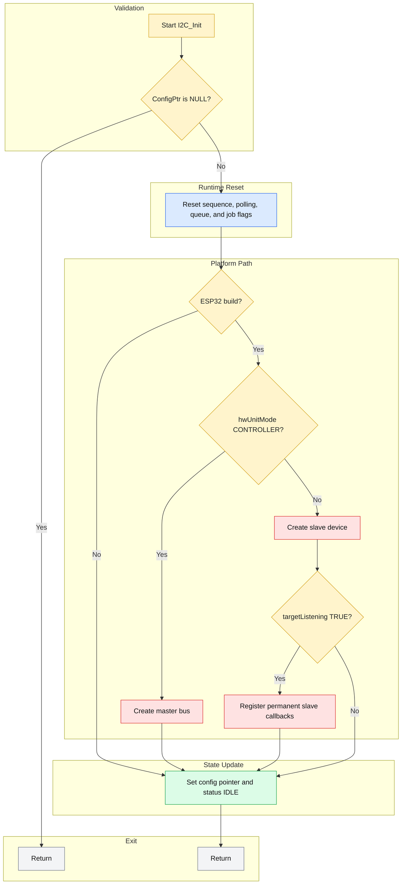
```mermaid
flowchart TD
  subgraph V[Validation]
    A[Start I2C_Init] --> B{ConfigPtr is NULL?}
  end

  subgraph R[Runtime Reset]
    D[Reset sequence, polling, queue, and job flags]
  end

  subgraph P[Platform Path]
    E{ESP32 build?}
    F{hwUnitMode CONTROLLER?}
    G[Create master bus]
    H[Create slave device]
    I{targetListening TRUE?}
    J[Register permanent slave callbacks]
  end

  subgraph S[State Update]
    K[Set config pointer and status IDLE]
  end

  subgraph X[Exit]
    C[Return]
    L[Return]
  end

  B -- Yes --> C
  B -- No --> D
  D --> E
  E -- No --> K
  E -- Yes --> F
  F -- Yes --> G
  F -- No --> H
  H --> I
  I -- Yes --> J
  I -- No --> K
  G --> K
  J --> K
  K --> L

  classDef validation fill:#fff4cc,stroke:#d4a017,color:#222;
  classDef action fill:#dbeafe,stroke:#2563eb,color:#111;
  classDef hw fill:#fee2e2,stroke:#dc2626,color:#111;
  classDef state fill:#dcfce7,stroke:#16a34a,color:#111;
  classDef ret fill:#f3f4f6,stroke:#6b7280,color:#111;
  class A,B,E,F,I validation;
  class D action;
  class G,H,J hw;
  class K state;
  class C,L ret;
```

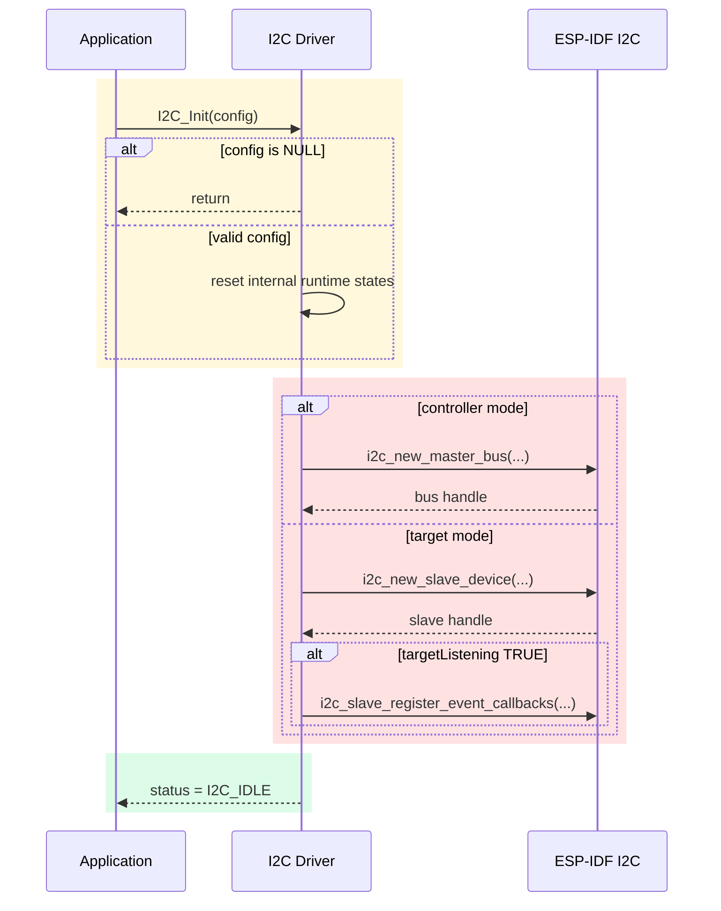
```mermaid
sequenceDiagram
  participant App as Application
  participant Drv as I2C Driver
  participant HW as ESP-IDF I2C

  rect rgb(255, 248, 220)
    App->>Drv: I2C_Init(config)
    alt config is NULL
      Drv-->>App: return
    else valid config
      Drv->>Drv: reset internal runtime states
    end
  end

  rect rgb(254, 226, 226)
    alt controller mode
      Drv->>HW: i2c_new_master_bus(...)
      HW-->>Drv: bus handle
    else target mode
      Drv->>HW: i2c_new_slave_device(...)
      HW-->>Drv: slave handle
      alt targetListening TRUE
        Drv->>HW: i2c_slave_register_event_callbacks(...)
      end
    end
  end

  rect rgb(220, 252, 231)
    Drv-->>App: status = I2C_IDLE
  end
```

###### 2) I2C_DeInit
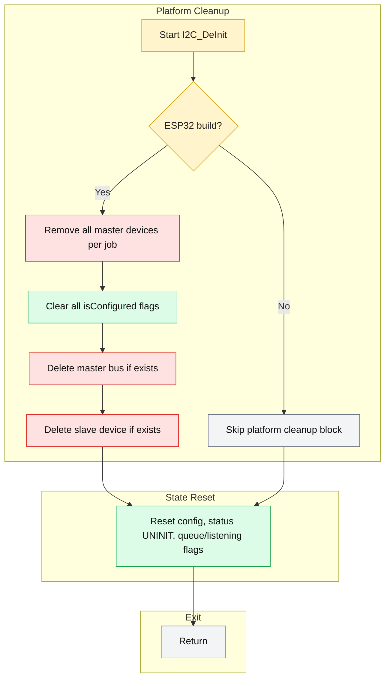
```mermaid
flowchart TD
  subgraph P[Platform Cleanup]
    A[Start I2C_DeInit] --> B{ESP32 build?}
    C[Remove all master devices per job]
    D[Clear all isConfigured flags]
    E[Delete master bus if exists]
    F[Delete slave device if exists]
    G[Skip platform cleanup block]
  end

  subgraph S[State Reset]
    H[Reset config, status UNINIT, queue/listening flags]
  end

  subgraph X[Exit]
    I[Return]
  end

  B -- Yes --> C
  C --> D
  D --> E
  E --> F
  B -- No --> G
  F --> H
  G --> H
  H --> I

  classDef validation fill:#fff4cc,stroke:#d4a017,color:#222;
  classDef hw fill:#fee2e2,stroke:#dc2626,color:#111;
  classDef state fill:#dcfce7,stroke:#16a34a,color:#111;
  classDef ret fill:#f3f4f6,stroke:#6b7280,color:#111;
  class A,B validation;
  class C,E,F hw;
  class D,H state;
  class G,I ret;
```

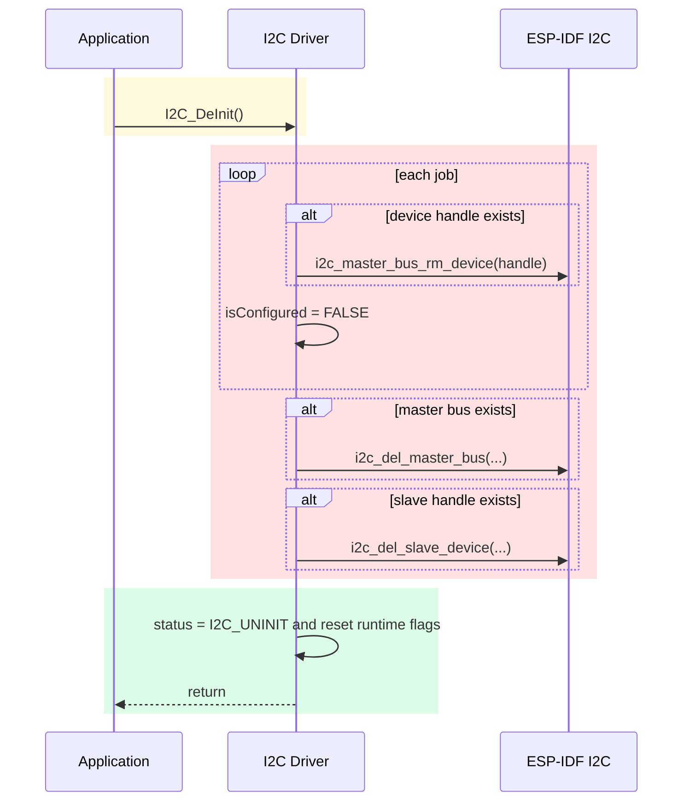
```mermaid
sequenceDiagram
  participant App as Application
  participant Drv as I2C Driver
  participant HW as ESP-IDF I2C

  rect rgb(255, 248, 220)
    App->>Drv: I2C_DeInit()
  end

  rect rgb(254, 226, 226)
    loop each job
      alt device handle exists
        Drv->>HW: i2c_master_bus_rm_device(handle)
      end
      Drv->>Drv: isConfigured = FALSE
    end
    alt master bus exists
      Drv->>HW: i2c_del_master_bus(...)
    end
    alt slave handle exists
      Drv->>HW: i2c_del_slave_device(...)
    end
  end

  rect rgb(220, 252, 231)
    Drv->>Drv: status = I2C_UNINIT and reset runtime flags
    Drv-->>App: return
  end
```

###### 3) I2C_SetupEB
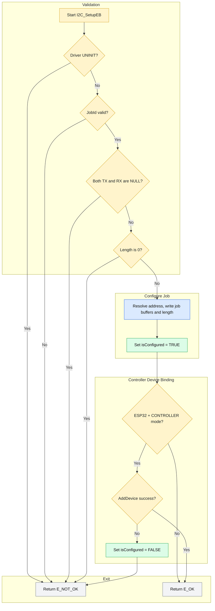
```mermaid
flowchart TD
  subgraph V[Validation]
    A[Start I2C_SetupEB] --> B{Driver UNINIT?}
    C{JobId valid?}
    D{Both TX and RX are NULL?}
    E{Length is 0?}
  end

  subgraph Cfg[Configure Job]
    F[Resolve address, write job buffers and length]
    G[Set isConfigured = TRUE]
  end

  subgraph HW[Controller Device Binding]
    H{ESP32 + CONTROLLER mode?}
    I{AddDevice success?}
    J[Set isConfigured = FALSE]
  end

  subgraph X[Exit]
    R[Return E_NOT_OK]
    Q[Return E_OK]
  end

  B -- Yes --> R
  B -- No --> C
  C -- No --> R
  C -- Yes --> D
  D -- Yes --> R
  D -- No --> E
  E -- Yes --> R
  E -- No --> F
  F --> G
  G --> H
  H -- No --> Q
  H -- Yes --> I
  I -- No --> J
  J --> R
  I -- Yes --> Q

  classDef validation fill:#fff4cc,stroke:#d4a017,color:#222;
  classDef action fill:#dbeafe,stroke:#2563eb,color:#111;
  classDef hw fill:#fee2e2,stroke:#dc2626,color:#111;
  classDef state fill:#dcfce7,stroke:#16a34a,color:#111;
  classDef ret fill:#f3f4f6,stroke:#6b7280,color:#111;
  class A,B,C,D,E,H,I validation;
  class F action;
  class G,J state;
  class R,Q ret;
```

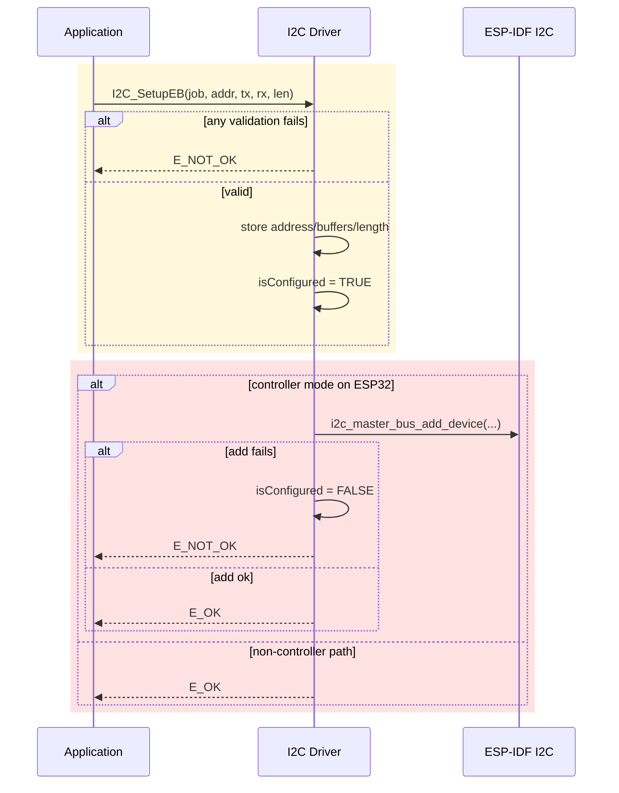
```mermaid
sequenceDiagram
  participant App as Application
  participant Drv as I2C Driver
  participant HW as ESP-IDF I2C

  rect rgb(255, 248, 220)
    App->>Drv: I2C_SetupEB(job, addr, tx, rx, len)
    alt any validation fails
      Drv-->>App: E_NOT_OK
    else valid
      Drv->>Drv: store address/buffers/length
      Drv->>Drv: isConfigured = TRUE
    end
  end

  rect rgb(254, 226, 226)
    alt controller mode on ESP32
      Drv->>HW: i2c_master_bus_add_device(...)
      alt add fails
        Drv->>Drv: isConfigured = FALSE
        Drv-->>App: E_NOT_OK
      else add ok
        Drv-->>App: E_OK
      end
    else non-controller path
      Drv-->>App: E_OK
    end
  end
```

###### 4) I2C_AsyncTransmit
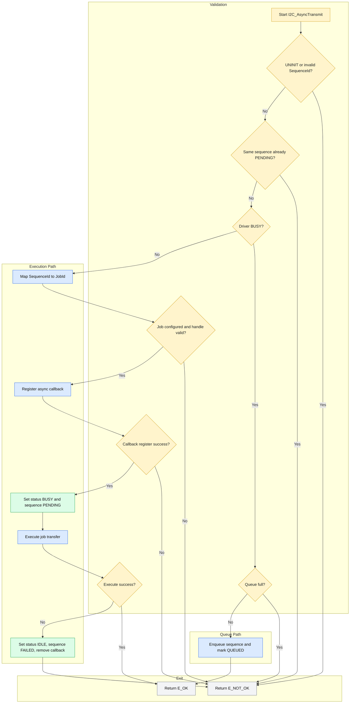
```mermaid
flowchart TD
  subgraph V[Validation]
    A[Start I2C_AsyncTransmit] --> B{UNINIT or invalid SequenceId?}
    C{Same sequence already PENDING?}
    D{Driver BUSY?}
    E{Queue full?}
    H{Job configured and handle valid?}
    J{Callback register success?}
    M{Execute success?}
  end

  subgraph QN[Queue Path]
    F[Enqueue sequence and mark QUEUED]
  end

  subgraph EX[Execution Path]
    G[Map SequenceId to JobId]
    I[Register async callback]
    K[Set status BUSY and sequence PENDING]
    L[Execute job transfer]
    N[Set status IDLE, sequence FAILED, remove callback]
  end

  subgraph X[Exit]
    R[Return E_NOT_OK]
    Q[Return E_OK]
  end

  B -- Yes --> R
  B -- No --> C
  C -- Yes --> R
  C -- No --> D
  D -- Yes --> E
  E -- Yes --> R
  E -- No --> F
  F --> Q
  D -- No --> G
  G --> H
  H -- No --> R
  H -- Yes --> I
  I --> J
  J -- No --> R
  J -- Yes --> K
  K --> L
  L --> M
  M -- Yes --> Q
  M -- No --> N
  N --> R

  classDef validation fill:#fff4cc,stroke:#d4a017,color:#222;
  classDef action fill:#dbeafe,stroke:#2563eb,color:#111;
  classDef hw fill:#fee2e2,stroke:#dc2626,color:#111;
  classDef state fill:#dcfce7,stroke:#16a34a,color:#111;
  classDef ret fill:#f3f4f6,stroke:#6b7280,color:#111;
  class A,B,C,D,E,H,J,M validation;
  class F,G,I,L action;
  class K,N state;
  class R,Q ret;
```

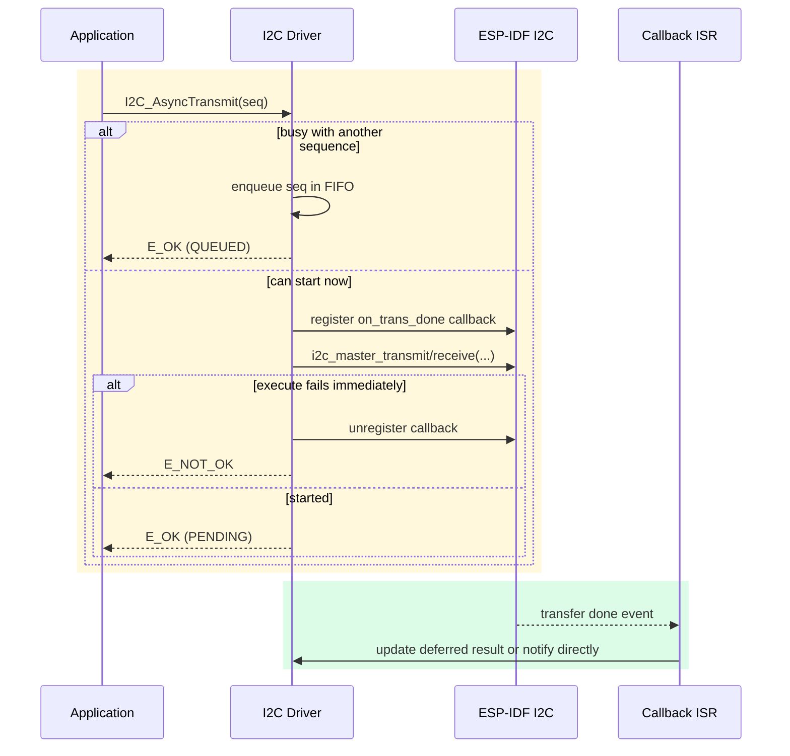
```mermaid
sequenceDiagram
  participant App as Application
  participant Drv as I2C Driver
  participant HW as ESP-IDF I2C
  participant ISR as Callback ISR

  rect rgb(255, 248, 220)
    App->>Drv: I2C_AsyncTransmit(seq)
    alt busy with another sequence
      Drv->>Drv: enqueue seq in FIFO
      Drv-->>App: E_OK (QUEUED)
    else can start now
      Drv->>HW: register on_trans_done callback
      Drv->>HW: i2c_master_transmit/receive(...)
      alt execute fails immediately
        Drv->>HW: unregister callback
        Drv-->>App: E_NOT_OK
      else started
        Drv-->>App: E_OK (PENDING)
      end
    end
  end

  rect rgb(220, 252, 231)
    HW-->>ISR: transfer done event
    ISR->>Drv: update deferred result or notify directly
  end
```

###### 5) I2C_SyncTransmit
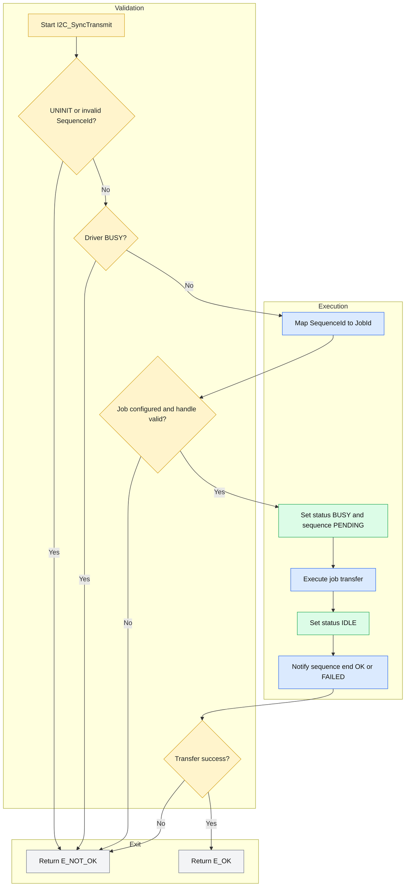
```mermaid
flowchart TD
  subgraph V[Validation]
    A[Start I2C_SyncTransmit] --> B{UNINIT or invalid SequenceId?}
    C{Driver BUSY?}
    E{Job configured and handle valid?}
    J{Transfer success?}
  end

  subgraph EX[Execution]
    D[Map SequenceId to JobId]
    F[Set status BUSY and sequence PENDING]
    G[Execute job transfer]
    H[Set status IDLE]
    I[Notify sequence end OK or FAILED]
  end

  subgraph X[Exit]
    R[Return E_NOT_OK]
    K[Return E_OK]
  end

  B -- Yes --> R
  B -- No --> C
  C -- Yes --> R
  C -- No --> D
  D --> E
  E -- No --> R
  E -- Yes --> F
  F --> G
  G --> H
  H --> I
  I --> J
  J -- Yes --> K
  J -- No --> R

  classDef validation fill:#fff4cc,stroke:#d4a017,color:#222;
  classDef action fill:#dbeafe,stroke:#2563eb,color:#111;
  classDef state fill:#dcfce7,stroke:#16a34a,color:#111;
  classDef ret fill:#f3f4f6,stroke:#6b7280,color:#111;
  class A,B,C,E,J validation;
  class D,G,I action;
  class F,H state;
  class R,K ret;
```

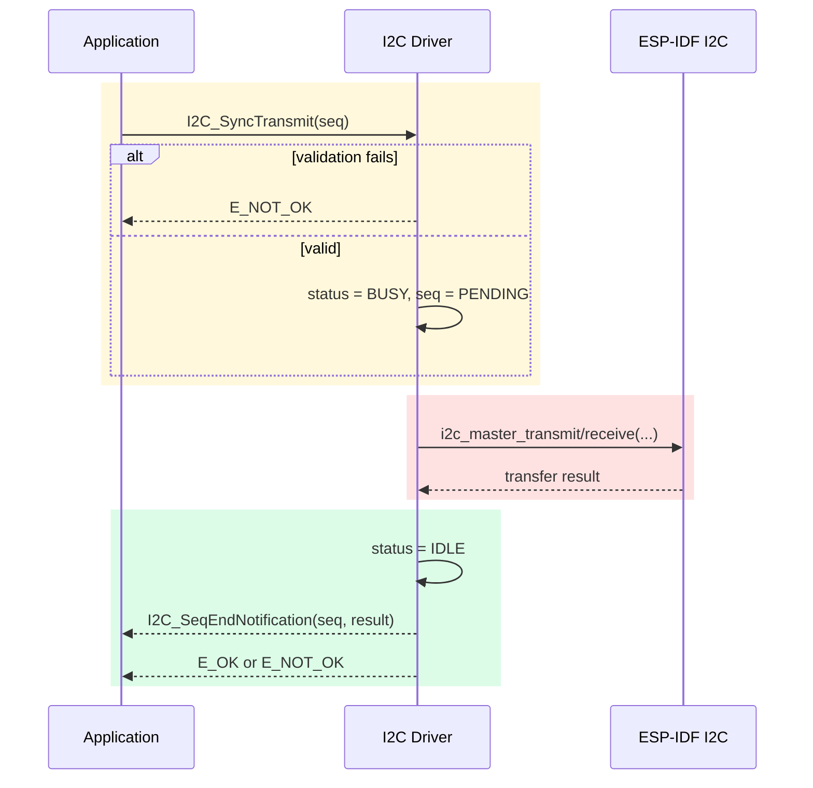
```mermaid
sequenceDiagram
  participant App as Application
  participant Drv as I2C Driver
  participant HW as ESP-IDF I2C

  rect rgb(255, 248, 220)
    App->>Drv: I2C_SyncTransmit(seq)
    alt validation fails
      Drv-->>App: E_NOT_OK
    else valid
      Drv->>Drv: status = BUSY, seq = PENDING
    end
  end

  rect rgb(254, 226, 226)
    Drv->>HW: i2c_master_transmit/receive(...)
    HW-->>Drv: transfer result
  end

  rect rgb(220, 252, 231)
    Drv->>Drv: status = IDLE
    Drv-->>App: I2C_SeqEndNotification(seq, result)
    Drv-->>App: E_OK or E_NOT_OK
  end
```

###### 6) I2C_StartListening
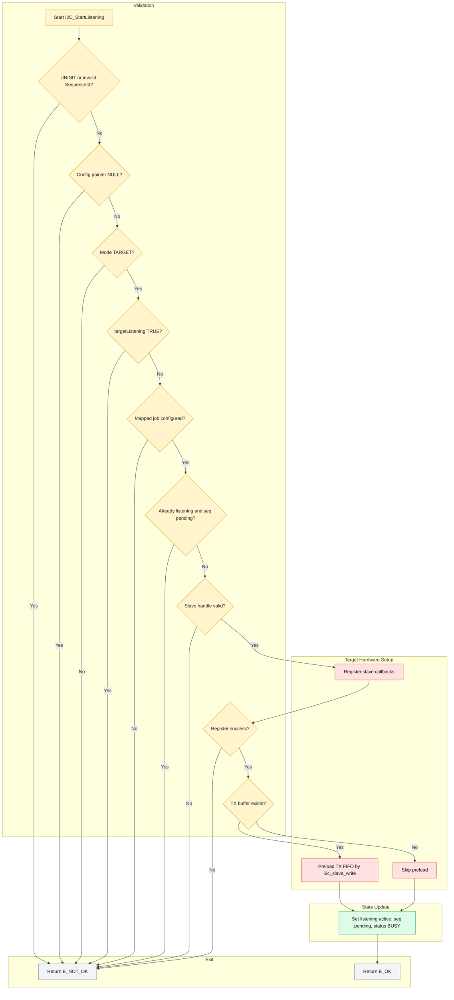
```mermaid
flowchart TD
  subgraph V[Validation]
    A[Start I2C_StartListening] --> B{UNINIT or invalid SequenceId?}
    C{Config pointer NULL?}
    D{Mode TARGET?}
    E{targetListening TRUE?}
    F{Mapped job configured?}
    G{Already listening and seq pending?}
    H{Slave handle valid?}
    J{Register success?}
    K{TX buffer exists?}
  end

  subgraph HW[Target Hardware Setup]
    I[Register slave callbacks]
    L[Preload TX FIFO by i2c_slave_write]
    M[Skip preload]
  end

  subgraph S[State Update]
    N[Set listening active, seq pending, status BUSY]
  end

  subgraph X[Exit]
    R[Return E_NOT_OK]
    O[Return E_OK]
  end

  B -- Yes --> R
  B -- No --> C
  C -- Yes --> R
  C -- No --> D
  D -- No --> R
  D -- Yes --> E
  E -- Yes --> R
  E -- No --> F
  F -- No --> R
  F -- Yes --> G
  G -- Yes --> R
  G -- No --> H
  H -- No --> R
  H -- Yes --> I
  I --> J
  J -- No --> R
  J -- Yes --> K
  K -- Yes --> L
  K -- No --> M
  L --> N
  M --> N
  N --> O

  classDef validation fill:#fff4cc,stroke:#d4a017,color:#222;
  classDef hw fill:#fee2e2,stroke:#dc2626,color:#111;
  classDef state fill:#dcfce7,stroke:#16a34a,color:#111;
  classDef ret fill:#f3f4f6,stroke:#6b7280,color:#111;
  class A,B,C,D,E,F,G,H,J,K validation;
  class I,L,M hw;
  class N state;
  class R,O ret;
```

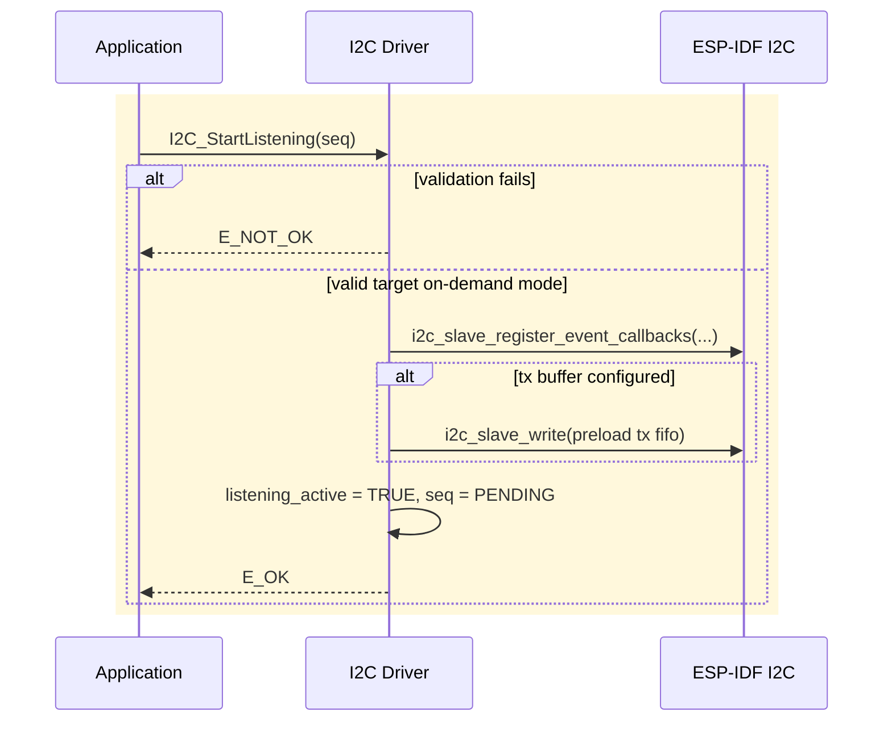
```mermaid
sequenceDiagram
  participant App as Application
  participant Drv as I2C Driver
  participant HW as ESP-IDF I2C

  rect rgb(255, 248, 220)
    App->>Drv: I2C_StartListening(seq)
    alt validation fails
      Drv-->>App: E_NOT_OK
    else valid target on-demand mode
      Drv->>HW: i2c_slave_register_event_callbacks(...)
      alt tx buffer configured
        Drv->>HW: i2c_slave_write(preload tx fifo)
      end
      Drv->>Drv: listening_active = TRUE, seq = PENDING
      Drv-->>App: E_OK
    end
  end
```

###### 7) I2C_MainFunction
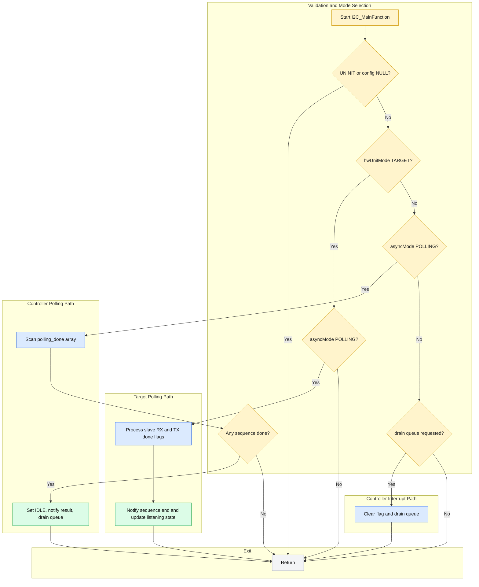
```mermaid
flowchart TD
  subgraph V[Validation and Mode Selection]
    A[Start I2C_MainFunction] --> B{UNINIT or config NULL?}
    C{hwUnitMode TARGET?}
    D{asyncMode POLLING?}
    G{asyncMode POLLING?}
    I{Any sequence done?}
    K{drain queue requested?}
  end

  subgraph TP[Target Polling Path]
    E[Process slave RX and TX done flags]
    F[Notify sequence end and update listening state]
  end

  subgraph CP[Controller Polling Path]
    H[Scan polling_done array]
    J[Set IDLE, notify result, drain queue]
  end

  subgraph CI[Controller Interrupt Path]
    L[Clear flag and drain queue]
  end

  subgraph X[Exit]
    R[Return]
  end

  B -- Yes --> R
  B -- No --> C
  C -- Yes --> D
  D -- Yes --> E
  E --> F
  F --> R
  D -- No --> R
  C -- No --> G
  G -- Yes --> H
  H --> I
  I -- Yes --> J
  I -- No --> R
  J --> R
  G -- No --> K
  K -- Yes --> L
  K -- No --> R
  L --> R

  classDef validation fill:#fff4cc,stroke:#d4a017,color:#222;
  classDef action fill:#dbeafe,stroke:#2563eb,color:#111;
  classDef state fill:#dcfce7,stroke:#16a34a,color:#111;
  classDef ret fill:#f3f4f6,stroke:#6b7280,color:#111;
  class A,B,C,D,G,I,K validation;
  class E,H,L action;
  class F,J state;
  class R ret;
```

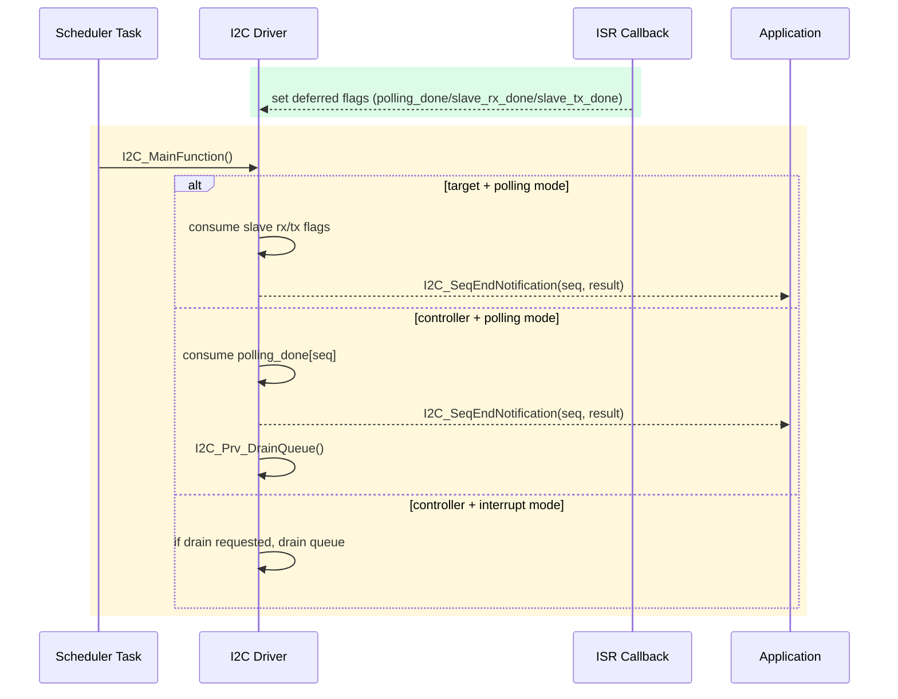
```mermaid
sequenceDiagram
  participant OS as Scheduler Task
  participant Drv as I2C Driver
  participant ISR as ISR Callback
  participant App as Application

  rect rgb(220, 252, 231)
    ISR-->>Drv: set deferred flags (polling_done/slave_rx_done/slave_tx_done)
  end

  rect rgb(255, 248, 220)
    OS->>Drv: I2C_MainFunction()
    alt target + polling mode
      Drv->>Drv: consume slave rx/tx flags
      Drv-->>App: I2C_SeqEndNotification(seq, result)
    else controller + polling mode
      Drv->>Drv: consume polling_done[seq]
      Drv-->>App: I2C_SeqEndNotification(seq, result)
      Drv->>Drv: I2C_Prv_DrainQueue()
    else controller + interrupt mode
      Drv->>Drv: if drain requested, drain queue
    end
  end
```

###### 8) I2C_SeqEndNotification callback usage
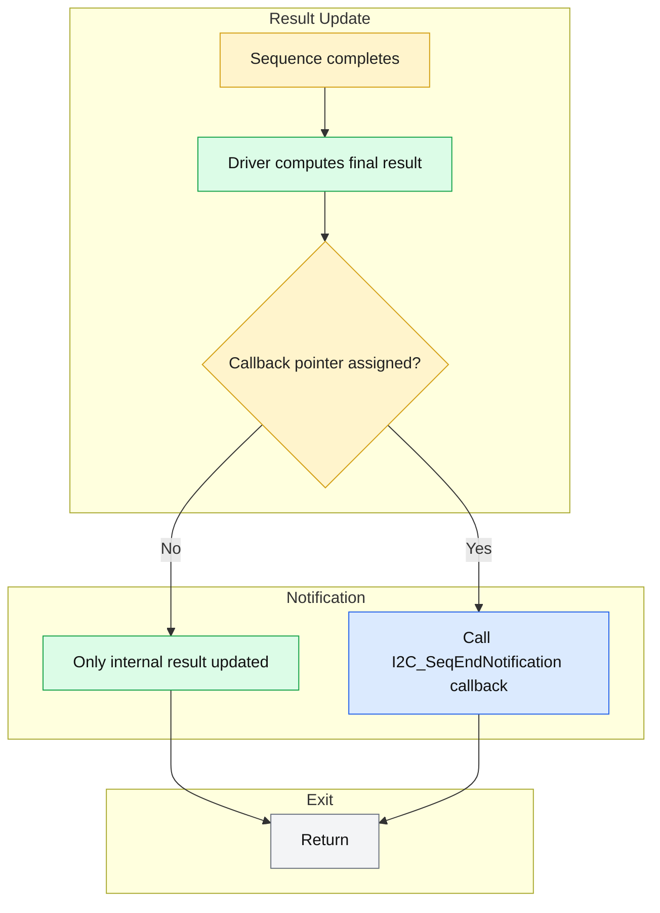
```mermaid
flowchart TD
  subgraph U[Result Update]
    A[Sequence completes] --> B[Driver computes final result]
    B --> C{Callback pointer assigned?}
  end

  subgraph N[Notification]
    D[Only internal result updated]
    E[Call I2C_SeqEndNotification callback]
  end

  subgraph X[Exit]
    F[Return]
  end

  C -- No --> D
  C -- Yes --> E
  D --> F
  E --> F

  classDef validation fill:#fff4cc,stroke:#d4a017,color:#222;
  classDef state fill:#dcfce7,stroke:#16a34a,color:#111;
  classDef action fill:#dbeafe,stroke:#2563eb,color:#111;
  classDef ret fill:#f3f4f6,stroke:#6b7280,color:#111;
  class A,C validation;
  class B,D state;
  class E action;
  class F ret;
```

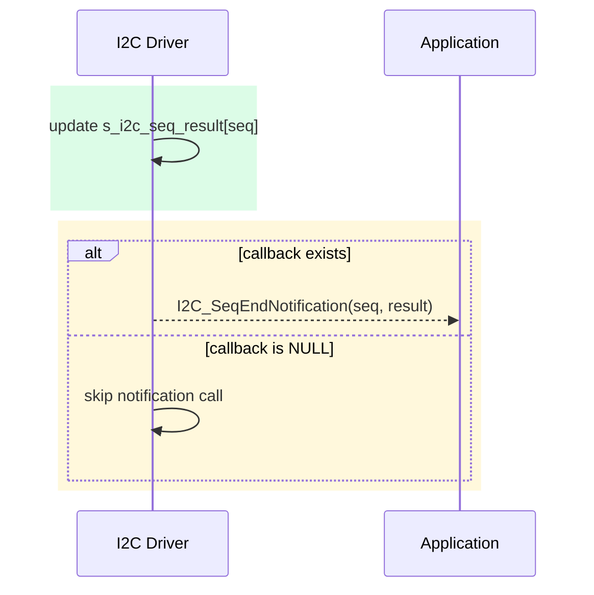
```mermaid
sequenceDiagram
  participant Drv as I2C Driver
  participant App as Application

  rect rgb(220, 252, 231)
    Drv->>Drv: update s_i2c_seq_result[seq]
  end

  rect rgb(255, 248, 220)
    alt callback exists
      Drv-->>App: I2C_SeqEndNotification(seq, result)
    else callback is NULL
      Drv->>Drv: skip notification call
    end
  end
```

##### Type Definitions
```c
typedef struct
{
    I2C_AddressType       nodeAddress;
    I2C_DataConstPtrType *txDataBufferPtr;
    I2C_DataPtrType      *rxDataBufferPtr;
    I2C_NumberOfDataType  length;
    boolean               isConfigured;
} I2C_JobEBConfigType;
```
External Buffer configuration per Job (AUTOSAR EB concept)
- Public Members:
  ```c
  I2C_AddressType nodeAddress;
  ```
  This type defines the address type for the I2C Driver. The type should be chosen for the specific MCU platform (best performance).

  ```c
  I2C_DataConstPtrType *txDataBufferPtr;
  ```
  Definition for the pointer type for TX buffer handling

  ```c
  I2C_DataPtrType      *rxDataBufferPtr;
  ```
  Definition for the pointer type for general buffer handling.

  ```c
  I2C_NumberOfDataType  length;
  ```
  Type to define the number of data elements to be sent and / or received during a transmission.

  ```
  boolean isConfigured;
  ```
  A validity gate for each Job’s external buffer setup.

  It prevents runtime use of uninitialized or partially configured job entries.

##### Macros
```c
I2C_XFER_TIMEOUT_MS
```
Default transfer timeout in ms (-1 = wait forever)

```c
I2C_MASTER_QUEUE_DEPTH
```
ESP-IDF master transaction queue depth for async callbacks

```c
I2C_SLAVE_BUF_DEPTH
```
Slave TX/RX ring-buffer depth in bytes

```c
I2C_QUEUE_SIZE
```
FIFO queue depth for queued asynchronous sequences.

```c
I2C_MAX_JOBS
```
Maximum number of supported jobs.

```c
I2C_MAX_SEQUENCES
```
Maximum number of supported sequences.

##### Header Files
- `I2c.h`: Public API declarations, AUTOSAR-aligned types, status/result enums.
- `gconf_sy_dat.h`: Platform/microcontroller selection macros used in compile-time branching.
- ESP32 path:
  - `driver/i2c_master.h`
  - `driver/i2c_slave.h`
  - `esp_err.h`
  - `esp_log.h`
- STM32 path:
  - `stm32f4xx_hal.h`

##### Struct
- `I2C_JobEBConfigType`
  - Purpose: Stores job-level external buffer configuration.
  - Key fields: address, TX pointer, RX pointer, data length, and `isConfigured` validity bit.

##### Enumerations
- `I2C_StatusType` (used in implementation):
  - Typical runtime states: `I2C_UNINIT`, `I2C_IDLE`, `I2C_BUSY`.
- `I2C_SequenceResultType` (used in implementation):
  - Sequence outcomes include values such as `I2C_SEQ_OK`, `I2C_SEQ_PENDING`, `I2C_SEQ_QUEUED`, `I2C_SEQ_FAILED`, `I2C_SEQ_NACK`.

Note: Exact enum definitions are declared in `I2c.h`; this section describes implementation usage in `I2c.c`.


---

### Summary Section (Summary of Notes)
This AUTOSAR-based I2C driver wraps low-level MCU drivers (currently ESP32-S3 path implemented) and provides a consistent API for initialization, buffer setup, synchronous/asynchronous transfer, and target listening. The design centers around per-job EB configuration with a strict validity flag (`isConfigured`), sequence-based state/result tracking, and callback-driven completion handling. `I2C_MainFunction` is essential for polling/deferred processing and FIFO queue draining in async workflows.